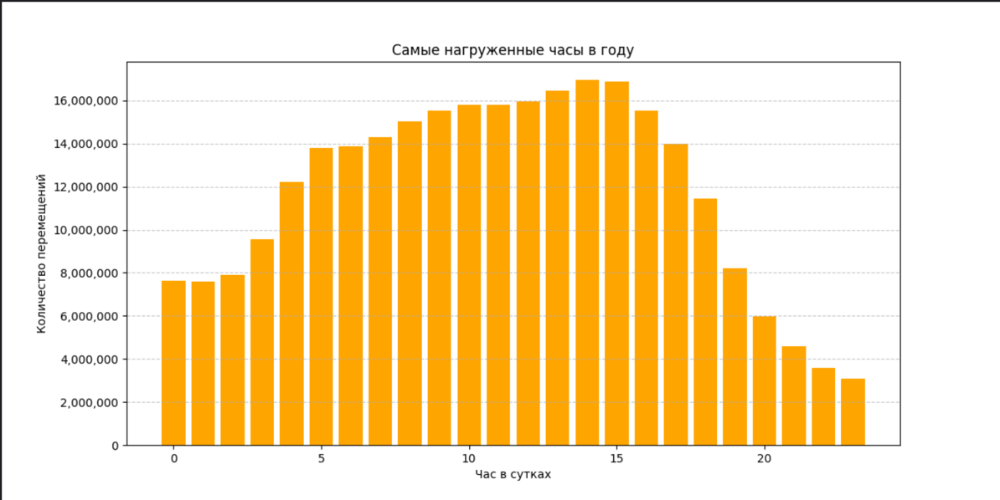
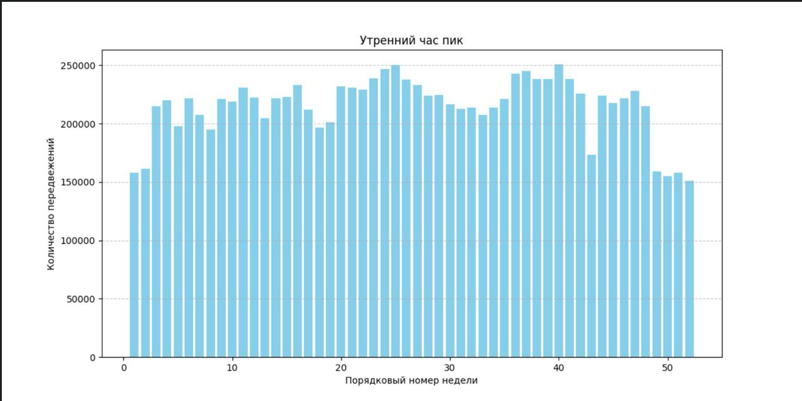
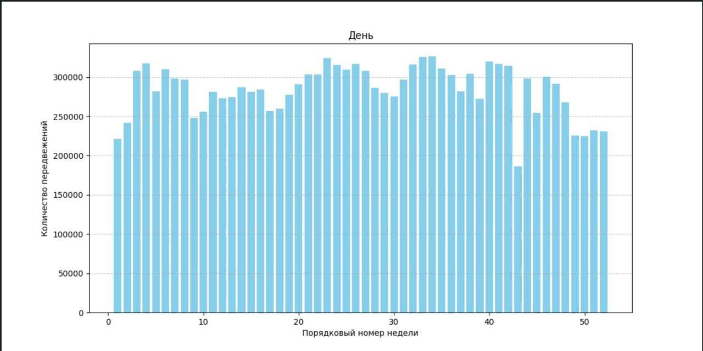
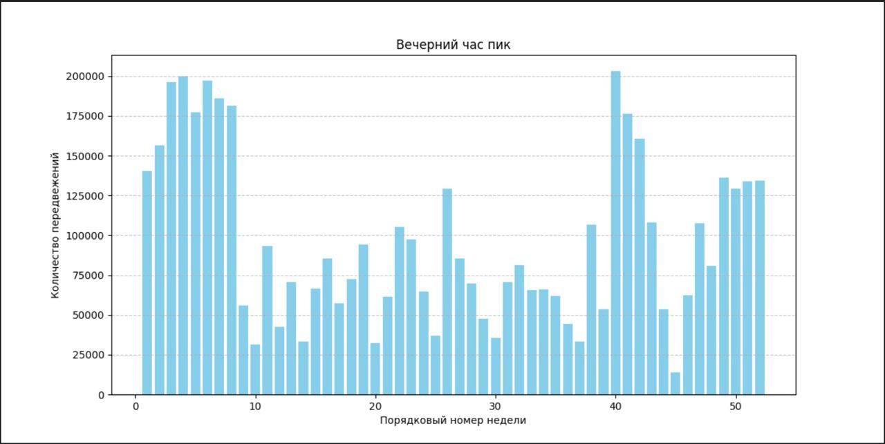

1. Проанализировать дорожно-транспортную ситуацию с течением времени.
* Rating of the busiest hours by connections
* Which router caught the most users at a specific hour
   
Диаграмма почасовой нагрузки в течение года

2. Диаграма загруженности года по неделям с количеством подключений к роутерам.
### Утренний час пик 6-11

### День 11-18

### Вечерний час пик 23-6

3. Замечания по тому, как можно было бы улучшить охват города.
* Routers with the most unfavorable positions
* Average signal strength for each hour of each router

Основная задача - это определить, насколько эффективно раставлены роутеры, 
а также дать комментарии по улучшению охвата города.
